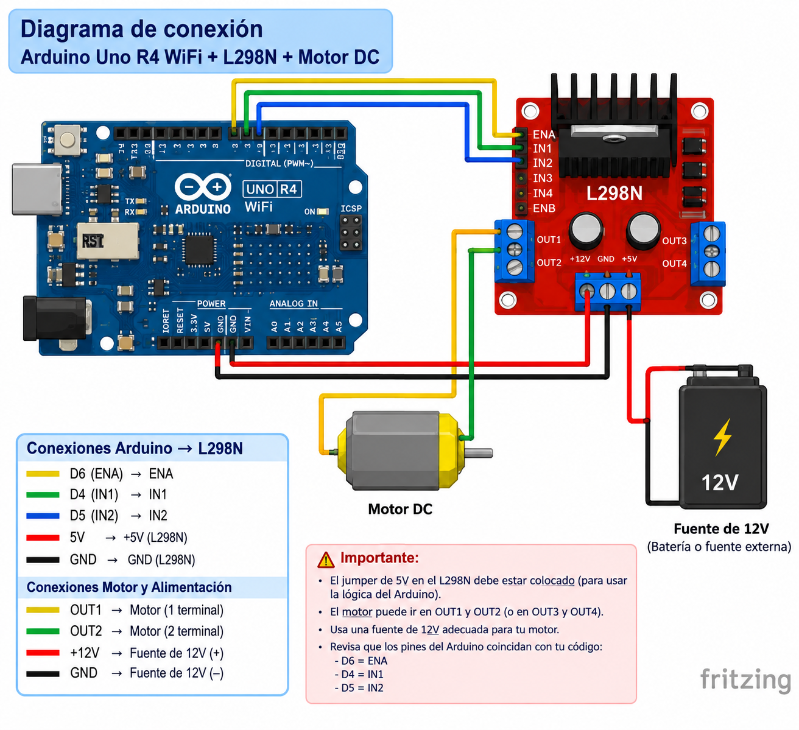

# Control de Servomotor por Interfaz Web

## Descripción

Esta práctica tiene como propósito implementar el control de un servomotor mediante una interfaz web, utilizando un Arduino UNO R4 WiFi como servidor.

El sistema permite enviar el ángulo deseado (entre 0° y 180°) desde una página web alojada en el propio Arduino, ya sea mediante un control deslizante (slider) o escribiendo el valor exacto en un campo numérico. El Arduino recibe la petición HTTP, procesa el ángulo solicitado y posiciona el servomotor en consecuencia.

## Objetivos

* Comprender el funcionamiento de un servidor web embebido en Arduino.
* Implementar comunicación entre una página web y un microcontrolador mediante peticiones HTTP.
* Controlar la posición de un servomotor a partir de datos enviados desde el navegador.
* Utilizar la librería `WiFiS3` para establecer conexión WiFi en el Arduino UNO R4 WiFi.
* Diseñar una interfaz web sencilla e interactiva con HTML, CSS y JavaScript.
* Aplicar el uso de peticiones `fetch()` para el envío de datos sin recargar la página.

## Herramientas y material utilizado

* Arduino UNO R4 WiFi.
* Arduino IDE.
* Servomotor (señal, VCC y GND).
* Protoboard (opcional, según montaje).
* Cables de conexión (jumpers).
* Fuente de alimentación externa para el servo (recomendado si el consumo es alto).
* Red WiFi de 2.4 GHz.

## Diagrama

El diagrama muestra las conexiones utilizadas para implementar el control del servomotor.

| Cable del servo | Pin del Arduino |
|---|---|
| Señal (naranja/amarillo) | Pin 9 (PWM) |
| VCC (rojo) | 5V |
| GND (café/negro) | GND |

[Ver carpeta Diagramas](diagrama)

## Código

El programa implementa un servidor web en el Arduino que recibe el ángulo deseado mediante una petición GET (`/?angulo=valor`) y mueve el servomotor a esa posición utilizando la librería `Servo`.

La página web se genera dinámicamente desde el propio Arduino e incluye un slider y un campo numérico con botón de envío.

[Ver código](codigo/control_por_voz_r4wifi.ino)

## Reporte

El reporte contiene la explicación del funcionamiento del sistema, la metodología utilizada, el análisis de los resultados y las conclusiones obtenidas durante la práctica.

[Ver Reporte](reporte/Reporte_Practica_ControlPorVoz.pdf)

## Resultados

Durante las pruebas, el Arduino se conectó correctamente a la red WiFi y sirvió la página de control de manera estable. El envío del ángulo desde el navegador, tanto por slider como por campo numérico, se reflejó de forma inmediata en la posición del servomotor.

Se comprobó que las peticiones HTTP fueron procesadas correctamente por el servidor embebido, respetando el rango de 0° a 180° mediante la función `constrain()`. La comunicación entre la página web y el Arduino se mantuvo estable durante múltiples solicitudes consecutivas.

Los resultados permitieron comprobar el funcionamiento tanto del circuito armado como de la lógica de comunicación web-microcontrolador implementada.

## Video

El video muestra el funcionamiento del control del servomotor desde la interfaz web, incluyendo el envío del ángulo mediante el slider y el campo numérico.

[Ver video](https://youtube.com/shorts/HLTl7cOfop0?feature=share)

[Ver carpeta Video](video)

## Conclusiones

La práctica permitió aplicar el concepto de servidor web embebido a un sistema de control físico, utilizando el Arduino UNO R4 WiFi como puente entre una interfaz de usuario y un actuador.

El uso de peticiones HTTP y `fetch()` permitió establecer comunicación entre la página web y el microcontrolador sin necesidad de recargar la página, mientras que la librería `Servo` permitió traducir los valores recibidos en movimiento físico preciso.

En conjunto, la práctica permitió relacionar el desarrollo web básico con el control de componentes electrónicos, comprobando su funcionamiento mediante el circuito armado y las pruebas realizadas.
